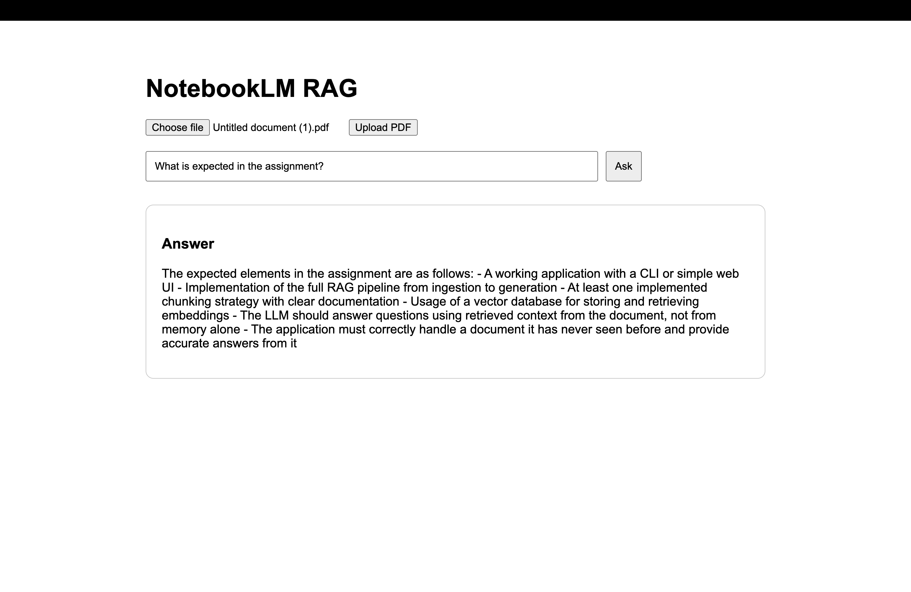

# NotebookLM RAG

A full-stack Retrieval-Augmented Generation (RAG) application inspired by Google NotebookLM where users can upload PDF documents and ask natural language questions grounded entirely in the uploaded document content.

---

# Features

- Upload PDF documents
- Extract and chunk document text
- Generate semantic embeddings using HuggingFace
- Store vectors persistently in Qdrant Vector Database
- Semantic retrieval using vector similarity search
- Grounded answer generation using OpenRouter LLMs
- Stateless backend architecture compatible with serverless deployment
- Simple React frontend UI

---

# Tech Stack

## Frontend
- React
- Vite
- Axios

## Backend
- Node.js
- Express
- Multer
- LangChain
- HuggingFace Inference API
- Qdrant Vector Database
- OpenRouter API

---

# Architecture

```text
PDF Upload
    ↓
Text Extraction
    ↓
Chunking
    ↓
Embedding Generation
    ↓
Qdrant Vector Storage
    ↓
Semantic Retrieval
    ↓
LLM Grounded Answer
```

---

# RAG Pipeline

The application implements a complete Retrieval-Augmented Generation pipeline:

1. PDF Upload
2. PDF Text Extraction
3. Chunking using RecursiveCharacterTextSplitter
4. Embedding Generation using HuggingFace
5. Persistent Vector Storage using Qdrant
6. Semantic Similarity Retrieval
7. Grounded Answer Generation using OpenRouter

---

# Chunking Strategy

The project uses LangChain's `RecursiveCharacterTextSplitter`.

Configuration:

```js
chunkSize: 1000
chunkOverlap: 200
```

This improves:
- semantic retrieval quality
- contextual continuity
- grounded response accuracy

---

# Vector Database

The application uses Qdrant Cloud as the vector database.

Features:
- persistent vector storage
- semantic similarity search
- metadata filtering using documentId
- cloud-hosted deployment

---

# Deployment Architecture

The backend is designed to be stateless and serverless-compatible.

Key improvements:
- Removed in-memory chunk storage
- Removed filesystem upload dependency
- Uses memory-based PDF processing
- Persistent vector storage through Qdrant Cloud

Compatible with:
- Vercel
- Serverless deployments

---

# Demo Screenshot



---

# Project Structure

```bash
notebooklm-rag/
│
├── client/
│
├── server/
│   ├── src/
│   │   ├── config/
│   │   ├── controllers/
│   │   ├── routes/
│   │   ├── services/
│   │   ├── utils/
│   │   └── server.js
│
├── screenshots/
│
└── README.md
```

---

# Setup Instructions

## Clone Repository

```bash
git clone https://github.com/tanmay933/NotebookLM-RAG.git
```

---

# Frontend Setup

```bash
cd client
npm install
npm run dev
```

---

# Backend Setup

```bash
cd server
npm install
npm run dev
```

---

# Environment Variables

## Server `.env`

```env
PORT=8000

OPENROUTER_API_KEY=your_openrouter_key

HF_API_KEY=your_huggingface_key

QDRANT_URL=your_qdrant_url

QDRANT_API_KEY=your_qdrant_api_key

QDRANT_COLLECTION=notebooklm
```

---

# API Routes

## Upload PDF

```http
POST /api/upload
```

Uploads, parses, chunks, embeds, and stores document vectors.

---

## Ask Question

```http
POST /api/chat
```

Request Body:

```json
{
  "question": "What are the requirements of the assignment?",
  "documentId": "your-document-id"
}
```

---

# Sample Questions

- What is expected in the assignment?
- What are the submission requirements?
- Explain the RAG pipeline.
- What is the marking scheme?
- What technologies are required?

---

# Future Improvements

- Streaming responses
- Chat history
- Multi-document conversations
- Better UI/UX
- Citation highlighting
- Reranking pipeline
- Authentication

---

# Author

Tanmay Mittal